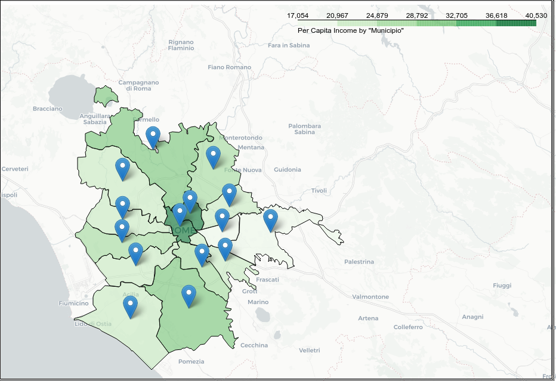
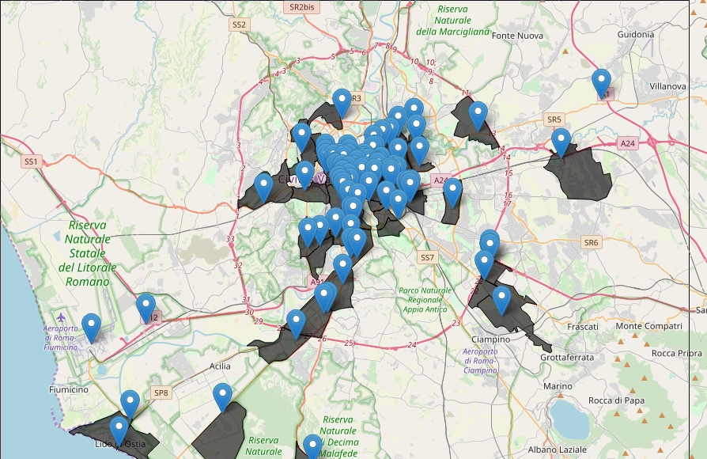
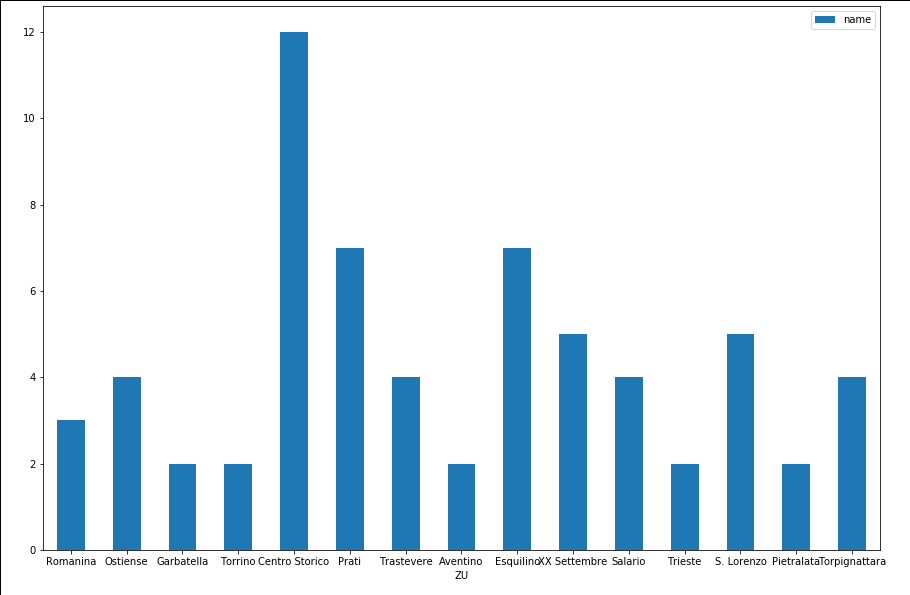
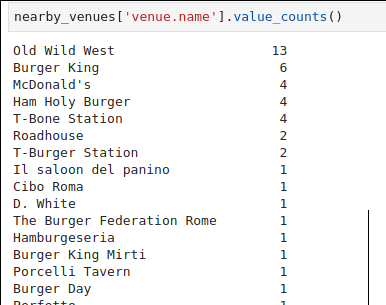
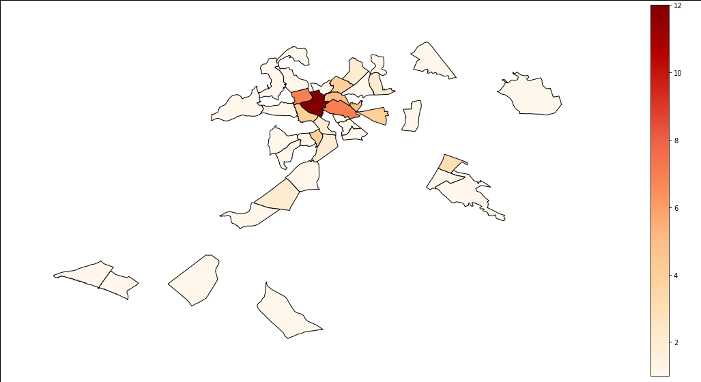

# Burger restaurants in Rome

## Introduction
In this project we want to find a good location for a restaurant. Specifically, we are interested in opening a **Burger restaurant** in **Rome** the capital of Italy. Rome is the home of 3 mio people and a very cultural city with a great history and a large number of different international cuisines. Although there is a trend towards eating healthier food, burger restaurants still enjoy great popularity.

We are also particularly interested in areas with other burger restaurants in neighborhood. We would also prefer locations **as close to city center as possible**. Chosing the right location for business is one of the difficult and discussable tasks, since there are a lot of criteria to be considered in order to achieve the high revenue.

We want to look at the following influencing factor:

 * the number of burger restaurants in the same zone
 * solvency of the population around the location 

In this project, we will implement the basic analysis and try to find the most optimal neighborhood to open a new burger restaurant according to those criteria. It's clear, that there are a lot of other additional factors, such as distance from parking places or distance from the main streets and sights are important. But these factors are not considered in this analysis.

## Buisness case
The stakeholders of our analysis are on the one hand investors who are looking for a suitable place to take over/open new restaurants and on the other hand tourists or simply people who like to eat a good burger.

The buisness case is to find a neighborhood in which already several burger restaurants exist.

In order to reach tourists, the centre is of course the place to go, but additionally, the question arises if there are other areas in Rome that are suitable for a burger restaurant.

## Data

The data we are using is publicly available. On the one hand by using wikipeda as a source and additionally the opendata platforms
of Rome/Italy.

* Geographical information
    * Wikipedia Data of Rome
    * Shapefile of Municipi di Roma: http://www.datiopen.it/it/opendata/Municipi_di_Roma_Capitale
    * Shapefile of Zone urbane: https://www.mapparoma.info/zone-urbanistiche/
* Statistical data of the municipi of Rome
    * Average Income figures of 2015 from https://www.comune.roma.it/web/it/analisi-statistiche.page
* Restaurant type information
    * Foursquare API: selection of restaurants accourding to the category type and location

We will look at:

 * the number of burger restaurants in the same zone 
 * the average income of the people there

## Methodology
* The income statistics of 2015 is used to determine the two municipi with highest
per capita income and to determine if there is region with high revenue outside
the of the touristic places.

The Italian capital Rome is divided into 15 municipalities and 155 zones. 

Afterwards the number of already existing burger restaurants is counted the zones.

## Results
The maps shows the average income per Municipi.

Two central areas with most touristic spots and highest average income are: 

* Municipio I – Historical Center
* Municipio II – Parioli/Nomentano

The map shows all burger locations in Rome

100 burger restaurants exist in Rome.

In which zones are more than one burger venue

Are there burger chains in Rome?

The map shows the zones with at leat one burger restaurant:

## Conclusion
The optimal zones for a burger restaurant are
Centro Storico (1A), Prati (17B), Esquilino (1F)